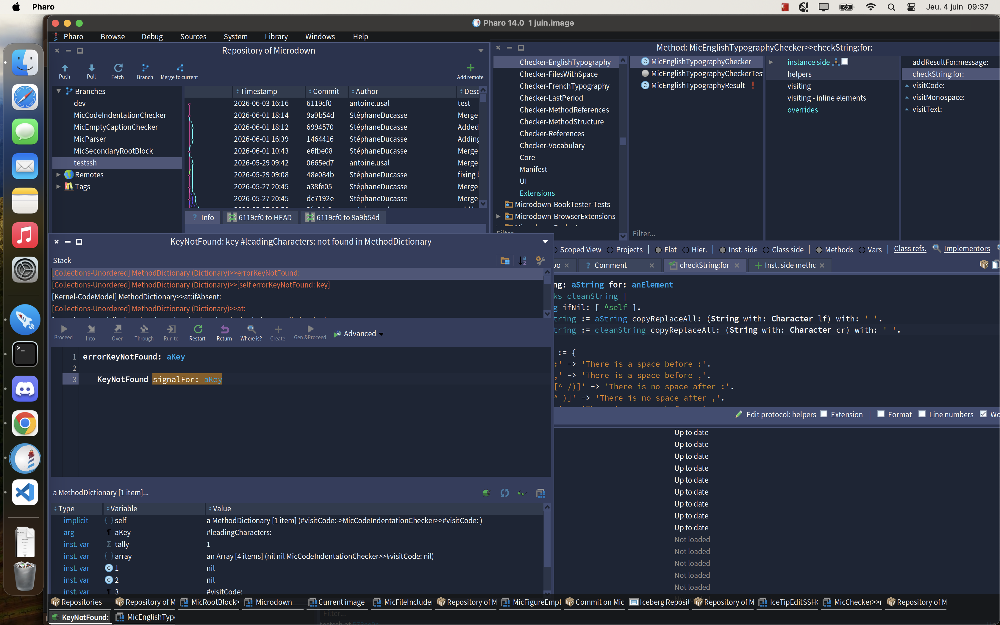
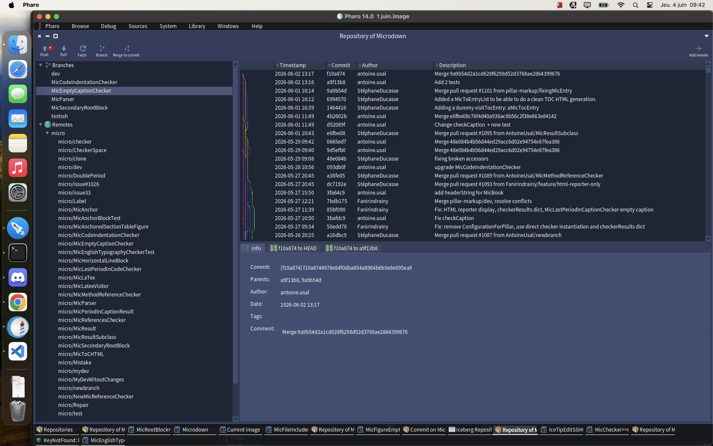
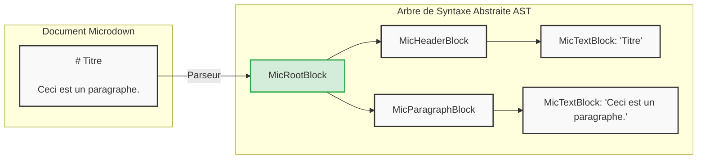
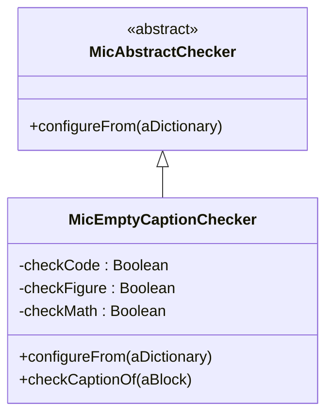
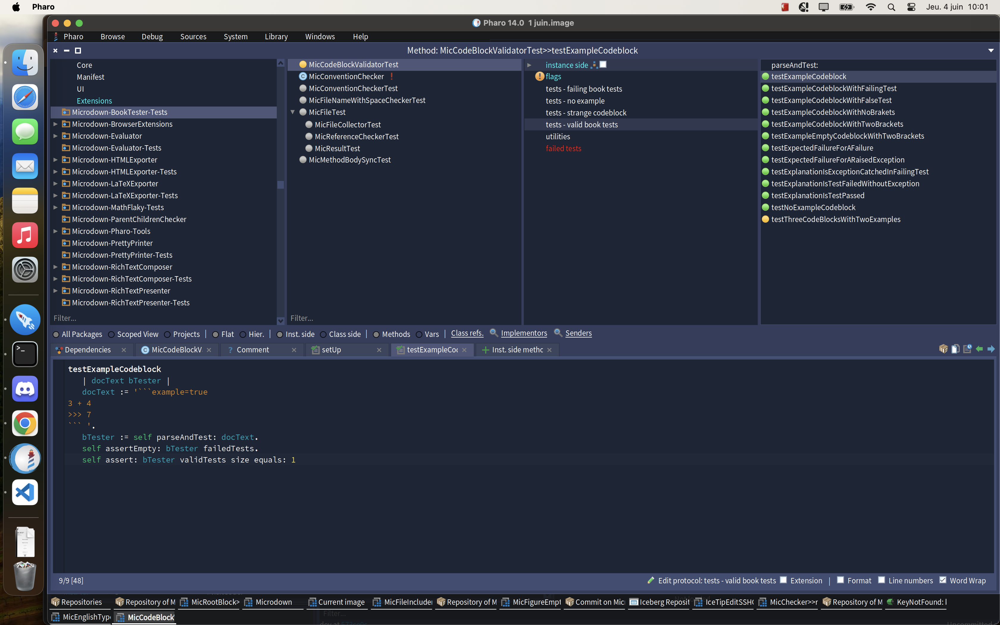

# Introduction Générale
J'ai effectué mon stage de deuxième année de BUT Informatique au centre de recherche Inria, au sein de l'équipe Evref. Cette équipe travaille principalement sur l'évolution et la maintenance des logiciels. Elle est notamment chargée de développer et de maintenir Pharo, un langage et un environnement de programmation purement orienté objet.

Pour documenter ce langage et accompagner la communauté, l'équipe rédige beaucoup de livres techniques. Cependant, écrire de tels ouvrages à plusieurs pose rapidement des problèmes : il faut s'assurer que les extraits de code fonctionnent toujours, que les références ne sont pas cassées et que les règles de typographie sont homogènes. Faire ces vérifications à la main sur des centaines de pages est chronophage et source d'erreurs.

C'est pour répondre à ce problème que s'est défini mon sujet de stage. L'équipe a mis en place un écosystème de génération de documents basé sur Microdown (un langage de balisage) et développe actuellement Valiboky, un outil de validation automatique. Mon objectif a été d'améliorer cette infrastructure pour qu'elle détecte d'elle-même les erreurs dans les manuscrits avant leur compilation en PDF ou en LaTeX.

Dans ce rapport, je vais détailler les différentes étapes de mon travail sur cet outil :

- Le Chapitre 1 revient sur mon intégration dans l'équipe, ma découverte de l'environnement Pharo et de ses outils de versioning comme Iceberg.

- Le Chapitre 2 explique le fonctionnement de l'analyse syntaxique (AST) et les corrections que j'ai apportées au parseur pour améliorer la traçabilité des erreurs.

- Le Chapitre 3 est consacré au cœur de mon développement : la conception de mes propres règles de vérification (les Checkers) en appliquant la méthode TDD.

- Le Chapitre 4 montre l'application concrète de ces développements lors de la génération de véritables livres, avec un focus sur la gestion de la typographie anglophone.


# Chapitre 1 : Immersion au sein de l'équipe Evref et découverte de Pharo

## 1.1 L'équipe Evref et l'environnement Pharo

Mon stage s'est déroulé chez Evref, une équipe de recherche de l'Inria dédiée à l'évolution des logiciels. C'est ce groupe qui maintient Pharo, un langage de programmation où le concept d'orientation objet est poussé à l'extrême.

Passer des langages vus à l'IUT à Pharo m'a demandé de changer totalement ma façon de penser. Ici, la règle est stricte : absolument **tout est un objet**, qu'il s'agisse d'un simple nombre ou d'une erreur. Le code s'exécute ensuite uniquement par l'envoi de messages entre ces entités.

L'environnement de travail m'a aussi beaucoup surpris. Au lieu des classiques fichiers texte, Pharo utilise une "Image". C'est un environnement persistant qui sauvegarde en permanence l'état de la mémoire et des objets. Détail intéressant : l'IDE complet est lui-même codé en Pharo.
Mon intégration s'est voulue très concrète. Dès les premiers jours, j'ai dû me plonger dans le code et maîtriser des outils spécifiques, comme leur Debugger interactif. C'est un outil fascinant qui permet d'éditer le code d'un programme qui tourne, sans avoir à l'interrompre ni à le recompiler.




## 1.2 Outils de versioning et cycle de développement avec Iceberg

L'autre défi de mon arrivée a été d'apprendre à travailler à plusieurs sur un projet open source de cette taille. Comme tout tourne dans une Image, Git ne s'utilise pas en ligne de commande de façon classique. Il faut passer par Iceberg, le client Git spécifiquement intégré à Pharo.

Après une configuration un peu exigeante (notamment pour les clés SSH), je me suis heurté à la réalité du code en équipe. Mes premiers essais d'intégration ont provoqué pas mal de conflits, allant jusqu'à créer des "classes fantômes" sur mon poste. Pour m'en sortir, j'ai dû comprendre comment nettoyer mon environnement et gérer mes commits depuis l'interface d'Iceberg. C'était complexe sur le moment, mais très utile. J'ai vite assimilé la méthode de travail : isoler un problème sur une branche liée à une Issue, corriger, tester en local, puis soumettre une Pull Request bien propre. C'est cette rigueur qui m'a permis d'intégrer mes premiers correctifs sur Microdown et Pillar dès le début du stage (PR #1030 et #1031).



--- 

# Chapitre 2 : Modélisation et Analyse Syntaxique avec Microdown

## 2.1 Le rôle de l'arbre syntaxique (AST)
Concrètement, pour que l'ordinateur comprenne un document Microdown (le langage de balisage de Pharo), il utilise un Parseur. Ce programme lit le texte brut et le transforme en un Arbre de Syntaxe Abstraite. Lors de ce processus, chaque élément du document, qu'il s'agisse d'un titre ou d'un bout de code, devient un nœud dans cet arbre, avec des relations hiérarchiques parent/enfant.

C'est cet arbre que le moteur Pillar va ensuite récupérer pour générer le rendu final en PDF ou en LaTeX (un standard très utilisé dans la recherche pour sa mise en page impeccable). Et pour parcourir cet arbre de données sans altérer sa structure, toute l'architecture s'appuie sur le Design Pattern Visitor.



## 2.2 Amélioration de la traçabilité : Lignes et Fichiers inclus

J'ai passé beaucoup de temps à fiabiliser cet arbre syntaxique. Le but technique était clair : le système devait pouvoir indiquer à l'utilisateur la ligne et le fichier exacts de n'importe quelle erreur de syntaxe.
J'ai commencé par m'occuper du comptage des lignes avec la propriété **startLine** (Issue #1064). Le problème se posait sur les éléments imbriqués : le parseur donnait bien la ligne de départ à l'élément enfant, mais oubliait de transmettre l'information au bloc parent conteneur. L'arbre final était donc incomplet. J'ai revu la logique d'assignation pour forcer la donnée à remonter d'un niveau à l'autre.

```smalltalk
nodeToInit := nextNode.
[ nodeToInit notNil and: [ nodeToInit startLine isNil ] ] whileTrue: [
    nodeToInit startLine: currentLineNumber.
    nodeToInit := nodeToInit parent ].
```

À la lecture de cet extrait, on remarque que la boucle permet de remonter dynamiquement la hiérarchie pour affecter le numéro de ligne courant aux blocs parents précédemment instanciés.
Ensuite, je me suis penché sur les documents inclus (Issue #1091). En Microdown, on peut importer un fichier externe dans un document principal. Avant mon intervention, si le fichier importé contenait une erreur, le système accusait à tort le document principal, ce qui rendait le débogage très difficile. J'ai donc développé le **MicSecondaryRootBlock**, un type de nœud conçu exclusivement pour mémoriser la référence d'origine du fichier inclus.

```smalltalk
testFileProperty
    | root fileRef |
    root := MicSecondaryRootBlock new.
    fileRef := 'fichierInclus.md'.
    
    root file: fileRef.
    
    self assert: root file equals: fileRef.
```

Cet extrait de test unitaire illustre bien la vérification du comportement attendu : on s'assure ici que la propriété file du nouveau nœud conserve fidèlement la chaîne de caractères pointant vers le fichier source.
Ces évolutions ont rendu le parseur beaucoup plus robuste. C'était un prérequis indispensable avant de développer la suite des outils de vérification.

--- 

# Chapitre 3 : Fiabilisation du code via les Linters, Checkers et Tests

## 3.1 : L'infrastructure de validation Valiboky

L'infrastructure de validation, nommée Valiboky, s'intègre à l'architecture de Pillar et Microdown pour automatiser l'application de règles de vérification sur les manuscrits. 

| Famille | Règle | Rôle |
| :--- | :--- | :--- |
| **Typographie** | *EMPTY CAPTION* | Vérifie qu'aucune légende n'est laissée vide. |
| **Typographie** | *HEADER CAPITALIZATION* | Vérifie que les majuscules dans les titres suivent une stratégie cohérente. |
| **Vocabulaire** | *VOCABULARY* | Utilise une liste de paires de mots pour interdire certains termes au profit d'autres. |
| **Affichage Code**| *CODE INDENTATION* | Vérifie que les blocs de code utilisent bien des tabulations pour l'indentation et non des espaces. |
| **Infrastructure**| *REFERENCE CHECKS* | Signale les définitions d'ancres dupliquées et les références manquantes. |
| **Sémantique** | *CODE EXPRESSION TEST* | Évalue concrètement un bloc de code pour s'assurer que le résultat calculé est correct. |
| **Évolution** | *DESYNCHRONIZED CODE* | Vérifie si les blocs de code sont bien synchronisés avec la version actuelle du système. |

L'architecture repose sur des objets indépendants appelés « Checkers ». Mon rôle a été de m'approprier cette architecture pour concevoir et intégrer mes propres règles.

### Focus sur la règle : Empty Caption

Parmi toutes ces règles, on m'a confié le développement complet du vérificateur de légendes vides (le MicEmptyCaptionChecker). Son fonctionnement est simple : il parcourt l'arbre syntaxique du document et lève une erreur s'il croise une image ou une équation mathématique sans texte explicatif. C'est une vérification critique, car une image sans légende va complètement casser la génération de la table des figures lors de l'exportation du PDF.

Pour rendre l'outil plus souple pour les auteurs, je l'ai rendu paramétrable. Grâce à un dictionnaire de configuration, l'utilisateur peut choisir d'activer cette vérification uniquement pour les images, uniquement pour les formules mathématiques, ou bien pour les deux à la fois.

## 3.2 Conception des Checkers

Pour éviter de produire des livres mal formatés, le projet s'appuie sur le **BookTester**. Il s'agit d'un Linter : un outil qui analyse le texte statiquement pour repérer les anomalies avant la compilation. Dans ce système, chaque règle de vérification isolée est appelée un Checker.


On m'a confié la conception intégrale du **MicEmptyCaptionChecker** (Issue #1065). Son rôle métier est de s'assurer qu'aucune image ou expression mathématique n'est insérée sans légende (caption). Pour que l'outil soit plus flexible pour les utilisateurs, j'ai pris l'initiative de le rendre paramétrable. J'y ai ajouté une configuration via un dictionnaire, permettant d'activer ou de désactiver spécifiquement certaines vérifications.

```smalltalk
configureFrom: aDictionary
    super configureFrom: aDictionary.
    aDictionary at: 'checkOnly' ifPresent: [ :list | 
        self checkCode: false.
        self checkFigure: false.
        self checkMath: false.
        (list includes: 'code') ifTrue: [ self checkCode: true ].
        (list includes: 'figure') ifTrue: [ self checkFigure: true ].
        (list includes: 'math') ifTrue: [ self checkMath: true ] ].
```

Comme le montre cet extrait, l'utilisation de la méthode includes: sur la liste des paramètres permet d'adapter dynamiquement les attributs booléens du Checker avant son exécution.

## 3.3 La culture du Test Unitaire et la méthode TDD

Sur un projet de cette taille, l'équipe applique strictement le TDD (Test-Driven Development). Ce paradigme impose d'écrire les tests automatisés avant même d'implémenter la logique métier. Tous mes développements devaient donc impérativement être couverts par des tests via SUnit (le framework de test de Pharo).
Honnêtement, cette méthode exigeante m'a un peu ralenti au départ, le temps d'apprendre à anticiper le comportement du code. Mais j'ai vite compris son intérêt : elle m'a fait gagner un temps précieux en m'évitant des régressions, tout en m'apportant une vraie confiance dans la stabilité de mes outils.

```smalltalk
testResultContainsMicElement
    | block checker |
    checker := MicEmptyCaptionChecker new.
    block := MicFigureBlock new.
    
    checker checkCaptionOf: block.
    
    self assert: checker results size equals: 1.
    self assert: checker results first micElement equals: block.
```

Ce test démontre bien l'approche TDD : en simulant la création d'un bloc figure sans légende, on s'assure via l'assertion (assert) que la collection des résultats du Checker contient exactement une erreur liée à ce bloc.



## 3.4 Refactoring et maintenance du code existant

Au-delà de la création de nouveaux modules, j'ai aussi activement participé à l'amélioration du code existant. J'ai notamment refactorisé la méthode **visitParagraph** (PR #1073). Sa complexité cyclomatique était devenue trop importante avec le temps, il fallait la scinder pour garantir sa maintenabilité.

J'ai également corrigé des anomalies critiques qui bloquaient purement et simplement la chaîne de génération des livres documentaires. L'une des interventions les plus notables a été la correction d'une sensibilité à la casse dans les chemins de fichiers (Issue #1075), qui faisait échouer la compilation sur certains systèmes d'exploitation. Enfin, j'ai contribué à la migration du projet vers la version 14 de Pharo (Issue #1082), un travail de fond nécessitant de remplacer de nombreuses méthodes dépréciées.

---

# Chapitre 4 : Application pratique : Génération de livres et règles typographiques

## 4.1 De la validation statique à la production d'ouvrages

Tout le travail effectué sur le parseur et les Checkers a finalement pris tout son sens lors de la production concrète de livres pour l'écosystème Pharo. Mon rôle ne s'est pas arrêté au développement de l'infrastructure : j'ai activement exploité le **BookTester** pour compiler, débugger et générer des ouvrages prêts à être publiés.

Traiter des documents de cette envergure a été très instructif. Il fallait faire le lien entre les avertissements du linter, corriger les fichiers sources en Microdown, et vérifier le rendu final exporté par Pillar. C'est là que mes travaux précédents ont payé : la précision de la traçabilité des lignes et des fichiers m'a fait gagner un temps considérable lors de la correction des manuscrits.

## 4.2 Gestion et automatisation de la typographie anglophone

La majorité de ces ouvrages étant rédigés en anglais pour la communauté internationale, j'ai dû faire face à une problématique spécifique liée au texte. Les conventions typographiques anglophones diffèrent du français. Par exemple, l'anglais n'admet pas d'espace avant les signes de ponctuation doubles (comme les deux-points ou les points d'interrogation) et utilise des guillemets spécifiques (les smart quotes “ ”).

J'ai donc été chargé de traiter ces règles typographiques directement dans la chaîne de génération. Le véritable enjeu technique était d'appliquer ces corrections de formatage uniquement sur les nœuds de texte standard, tout en préservant absolument l'intégrité des blocs de code. Un changement d'espace non désiré dans une balise de code aurait immédiatement provoqué une erreur d'exécution.

```smalltalk
checkString: aString for: anElement
    | checks |
    checks := { 
        ' \:' -> 'There is a space before :'.
        '\:[^ /)]' -> 'There is no space after :' 
    }.
    checks do: [ :pair |
        ((RxMatcher forString: pair key) matchesIn: aString) notEmpty ifTrue: [
            self addResultFor: anElement message: pair value ] ].
```

L'extrait ci-dessus illustre la logique de filtrage appliquée lors de la visite de l'arbre. En vérifiant le type du nœud courant, l'algorithme garantit que les règles de remplacement des espaces et des guillemets ne s'appliquent qu'au texte brut, excluant de facto les blocs de code encapsulés.
Réussir à cibler ces nœuds a nécessité une compréhension fine du parcours de l'arbre syntaxique, et m'a permis d'améliorer significativement la qualité visuelle du rendu final.

## 4.3 Traitement des expressions mathématiques et exportation vers LATEX

L'un des atouts majeurs de l'écosystème Pharo et Microdown pour le milieu académique est sa capacité à interagir nativement avec les standards de la recherche, et plus particulièrement avec LATEX.

Validation statique des formules :<<<<>>>>
Dans la rédaction d'ouvrages techniques, les équations sont primordiales. Comme évoqué dans le chapitre précédent, le **MicEmptyCaptionChecker** possède un attribut checkMath spécifiquement dédié à ces éléments. En Microdown, l'intégration de formules complexes se fait en utilisant la syntaxe classique de LATEX encadrée par des balises spécifiques (& pour l'équation, % pour les paramètres). Mon Checker vérifie rigoureusement que ces équations possèdent toutes une légende explicative.

$$\sum_{i=a}^{b-1}f(i)\le\int_{a}^{b}f(t)dt$$

Le rôle de Pillar dans la conversion finale :
L'ingéniosité de l'architecture repose sur la séparation entre la représentation des données et leur affichage. Une fois que le Parseur a validé la syntaxe et transformé le bloc précédent en un nœud MicMathBlock au sein de l'Arbre Syntaxique, c'est le moteur Pillar qui prend le relais.

En parcourant l'arbre grâce au design pattern Visitor, Pillar traduit dynamiquement chaque nœud dans le format de sortie cible. Lors d'une compilation destinée à l'impression, Pillar va automatiquement transposer ce nœud Microdown en un environnement \begin{equation} ... \end{equation} natif, garantissant ainsi une mise en page scientifique impeccable et conforme aux standards typographiques sans aucune intervention manuelle supplémentaire.


# Conclusion
Ce stage de deuxième année chez Evref a été une étape marquante de mon BUT. Pouvoir travailler dans un véritable laboratoire de recherche sur un projet open source donne tout de suite beaucoup plus de sens au travail que l'on fournit.

Techniquement, l'arrivée sur Pharo a été un gros défi. Le fait que "tout soit objet" m'a forcé à repenser ma manière d'aborder la programmation par rapport aux langages vus à l'IUT. J'ai aussi pu appliquer concrètement des concepts vus en cours (comme les arbres syntaxiques) et me frotter à des méthodes exigeantes comme le TDD. Même si cela m'a demandé un vrai temps d'adaptation, c'est très gratifiant de savoir qu'aujourd'hui, les modules de vérification que j'ai développés tournent réellement pour valider les livres officiels de Pharo.

Au-delà de la technique pure, j'ai surtout découvert la réalité du travail en équipe au quotidien. Entre la gestion des versions avec Iceberg, les Pull Requests et les revues de code, j'ai compris les véritables enjeux d'un projet de grande ampleur : la communication, la rigueur et la maintenabilité.

Finalement, ce stage m'a apporté une vraie méthode de travail, mais il m'a surtout fait découvrir de l'intérieur le monde de la recherche en informatique. Travailler dans un labo institutionnel, au milieu de chercheurs passionnés qui font évoluer leur propre langage, est très différent de l'image que j'avais de l'entreprise classique. La réflexion autour du code, l'innovation et le partage des connaissances à travers l'open source et la rédaction de livres sont au centre de tout. Ça a été une excellente expérience, très enrichissante, qui m'a donné une vision beaucoup plus large de l'informatique pour la suite de mon parcours.